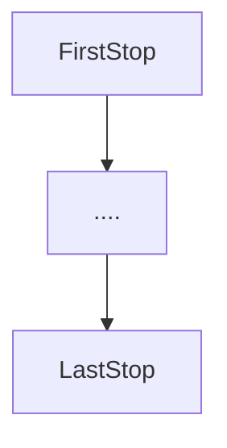

# Code Town City Bus Routes
[//]: <> (General outline of program scope)
This program is designed to determine the effects
on public transport systems if the hours of operation for school
times are better aligned to the needs of working parents

## Description
[//]: <> (Detailed description on the operation of the program)
The program is intended to be used by bus drivers on the
routes in that are foreseen to be impacted by the flow on effect
of changing school times. 
Drivers will be prompted to enter:

1) A route number

2) An amount of passengers at the first stop

3) An amount of passengers exiting the bus at each stop

4) An amount of passengers waiting at each stop except final

5) The amount of passengers exiting at the final stop


## Getting Started

### Dependencies:
[//]: <> (Set out basic platform and Python dependencies)
WindowsXP++/Mac0SX/Linux

Python Version 3.0 or later

Python base interpreter 3.xx\python.exe

## Executing the Program
[//]: <> (Detailed description on how the program is to be used
with minor visual explanations)
/*** Open the busstop.py file with Python3.xx ***/



1) The program will ask the user to input a route number which is
   used to reference the effected bus route. This should be numeric,
   without spaces, symbols or letters. An error prompt will be provided
   if this is entered incorrectly

Example:
```python
route_no = 0
def get_route():
    global route_no
    try:
        route_no = int(input("Please enter your route number: "))
    except ValueError:
        print("Please try again using only numbers")
        get_route()
    else:
        if route_no < 0:
            print("Current route number must be 0 or above, please try again")
            get_route()
            
```
2) The user will then be asked to enter how many stops are on this route.
   This will determine the length of the program and must be numeric only,
   containing no spaces, symbols or letters.

Example: 
```python
def get_route_stops(): 
    try:
        global route_stops
        route_stops = int(input("Please enter how many stops are on this route: "))
    except ValueError:
            print("Please enter a numerical value without symbols, spaces or letters")
            get_route_stops()
    else:
        if route_stops < 2:
            print("The total amount of stops must be greater than 1, please try again")
            get_route_stops()
```
3) The user will then be prompted at each stop how many passengers are 
   exiting the bus, as well as a number of passengers waiting to get onto 
   the bus. These inputs must also be numerical only and not include
   any spaces, symbols or letters.

Example:
```python
def get_passengers_off_bus():
        global passengers_off, current_passengers, stop_number
        try:
            passengers_off_bus = int(input(f"Enter how many passengers got "
                                           f"off the bus at stop #{stop_number}: "))
        except (TypeError, KeyError, ValueError):
            print("Values must numerical only, and positive. Please try again")
            get_passengers_off_bus()
        else:
            if passengers_off_bus > current_passengers:
                print("Passengers off the bus cannot exceed current passengers")
                print("Please try again")
                get_passengers_off_bus()
            elif passengers_off_bus < 0:
                print("Passengers off the bus cannot be negative")
                print("Please try again")
                get_passengers_off_bus()
            else:
                passengers_off += passengers_off_bus
                current_passengers -= passengers_off_bus
```
4) At the final stop the user will be prompted to enter the final information
   of how many passengers are exiting the bus at the final stop. This number
   must be numerical, it must also not be above or below the total amount of
   passengers currently on the bus. An error message will prompt the driver
   to re-enter the information.

Example:
```python

def set_last_stop():
    current_passengers = 47
    global stop_number, passengers_off, run
    try:
        passengers_off_last = int(input(f"Enter the number of passengers off the bus at the final stop: "))
    except(ValueError, TypeError, KeyError):
        print("Please enter only numerical values greater than or equal to 0")
        print("Please try again")
        set_last_stop()
    else:
        if passengers_off_last > current_passengers:
            print(f"There are {current_passengers} on the bus, please check your entry")
            set_last_stop()
        elif passengers_off_last != current_passengers:
            print(f"There are currently {current_passengers} on the bus, ", end='')
            print(f"you have entered {passengers_off_last}")                
            set_last_stop()
        else:
            passengers_off -= passengers_off_last
            
```


5) After the final information has been received by the program, the key data
   for the trip will be displayed on the screen informing the user of the
   outcome for the purpose of the programs scope.

Example output:

####Route number: 454
####Happy Customers: 20
####Unhappy Customers: 0
####Ratio of Happy to Unhappy Customers: 0.00

[//]: <> (Add Licensing)
###Licence:

This software is created under the GNU General Public License, version 3 (GPLv3)


